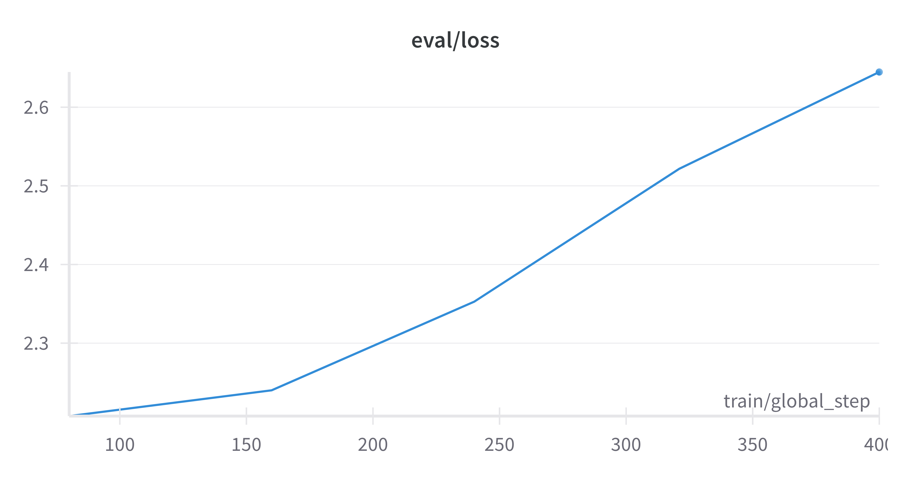

# diary-of-AI-ceo

Playing around with various generative AI tools to try and create a full-length (or close to) [Diary of a CEO](https://stevenbartlett.com/the-diary-of-a-ceo-podcast/) podcast.

High-level approach:
1. Get audio from existing podcasts on YouTube
1. Transcribe and apply speaker diarisation to audio
1. Fine-tune an LLM on transcriptions
1. Generate new podcasts with LLM
1. Use text-to-audio models to generate podcast

## Learnings

### General

- Whisper (large-v2) is very good at transcription but not perfect. Also doesn't do diarisation out of the box.
- Diarisation is still very difficult. [whisperX](https://github.com/m-bain/whisperX) makes mistakes which require human correction e.g. identifying additional non-existent speakers. Couldn't find many alternatives to this package though.
- [Paperspace](https://www.paperspace.com/) is great for renting GPUs (and has very responsive customer service!).
- They offer machines with lots of pre-installed libraries ("ML-in-a-box") but this led to versioning issues when trying to run Hugging Face scripts. Opted to use vanilla Ubuntu OS and install CUDA drivers myself.
- Installing CUDA drivers is a pain! Best resource was this [video](https://youtu.be/ttxtV966jyQ?t=966&feature=shared).
- 16GB VRAM more than sufficient for transcribing.
- Training 7B LLM on long sequences (close to model context length) consumes more memory (VRAM). Needed 24GB GPU (P6000) to fine-tune a 7B model.
- Started with transformers/example script (no trainer) but moved to axototl (used by https://twitter.com/Teknium1) to see if it's easier to resume a peft run from a checkpoint

### First fine-tuning attempt

Approach:
- Used `Mistral-7B-Instruct-v0.1` (axolotl didn't work with v0.2 at time of running)
- Kept podcast dialogue unchanged (always starts with host) and formatted to conform with Mistral chat template
- Podcasts typically exceed context window (4,096) when tokenized, hence chunked each podcast to maximum possible length whilst ensuring the first speaker was always the host
- With axototl it's easier to provide a single dataset and a split proportion rather than pointing to separate train and validation files. Hence I had 340 examples (after chunking) and used a 5% validation split, which amounts to 323 training examples.
- Long sequences required more memory for training (even with quantization and LoRA). Used a 24GB Nvidia Quadro P6000
- Trained for 5 epochs which took ~16 hours
- I saved checkpoints for the last 3 epochs
- Training loss decreased with sharp drops at start of each epoch
- Validation loss always increased - maybe expected since podcasts vary a lot depending on the guest. Can maybe drop validation set completely for future runs

<p align="center">

</p>

<p align="center">

</p>

Generating samples:
- Due to the way data is formatted we need a "prompt" for the model to complete. Chose to use the host's opening question which when completed would (hopefully) result in a back-and-forth conversation
- We need to rely on the model's world knowledge to generate convincing podcasts for new guests. The host rarely says the guest's full name in the opening so I decided to choose two guests with distinctive names (Elon and Barack) and added more relevant context such as "Top Gear" for Jeremy Clarkson
- I generated 3 opening prompts for these guests using GPT-4 after showing it a list of all openings from the training data
- Used nucleus sampling to generate the transcripts. Since the EOS token is also the token used to close the guest's speech in the chat template the model kept stopping after the guest's first response
- To prevent this I set the `eos_token_id` in the `generate()` method to `ü` which resulted in longer transcripts (I didn't go much over the context window of the model)
- Example transcripts are saved in `generated_transcripts/completed-model-checkpoint-*`. I also produced transcripts for the model without fine-tuning for comparison

General insights from samples generated:


### checkpoint-240
- Sometimes guest response inside host question - this sometimes happened in the training data so maybe picked up on this?
```
[INST] And then as you grew older, you were, from what I've read, a bit of a troublemaker at school. Yeah, I was, I was always getting into trouble. I was always doing things that were not sanctioned or approved. I was always tinkering with things that I shouldn't have been. I was always hacking into the school computer system. I was always trying to get into the computer room after hours and do all kinds of crazy things. [/INST]
```
- Sometimes doesn't add closing token: `[/INST]`
- Sometimes short and single-word guest responses e.g. `Yeah.</s>`
- Repeated phrases and heavy repitition at the end for the Clarkson transcript

### checkpoint-400 ***
- Are ads copied verbatim?

### general
- hallucincates loads e.g. `Yeah, I lost both elections.` (Obama checkpoint-240)
- tone of guest very different to reality - lack of speech in pre-training data?


## Resources
[List and describe the resources used in this project, including any frameworks, libraries, or external tools. Provide links where appropriate.]